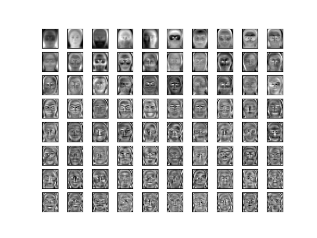
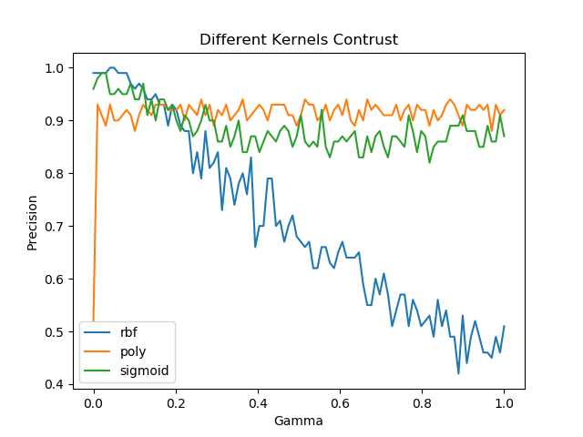
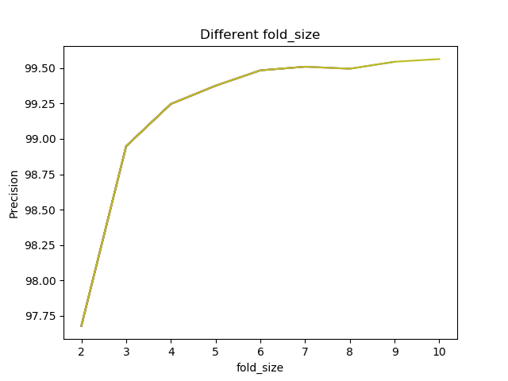
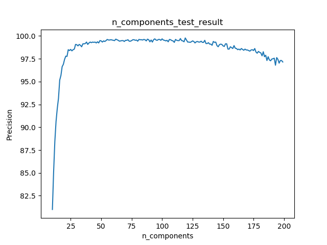
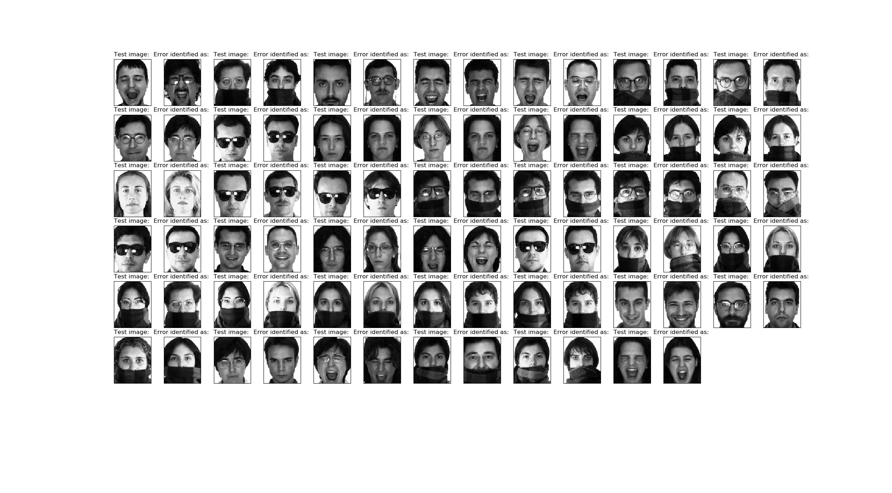

# PCA+SVM人脸识别
 本程序采用PCA+SVM+KFold方法对AR人脸数据集进行训练，并得出识别准确率。

> 如果本项目对你有帮助，希望可以点个★star支持哈~
 
## 开发环境
 
 * Python 3.6.2 x64

## IDE
 * PyCharm 2017.2.3

## 依赖包

* numpy(numpy-1.13.3+mkl-cp36-cp36m-win_amd64.whl)
* scipy(scipy-1.0.0-cp36-cp36m-win_amd64.whl)
* scikit-learn(scikit_learn-0.19.1-cp36-cp36m-win_amd64.whl)
* PIL(pip install pillow)

注: Windows下Python扩展包可以 [由此下载](https://www.lfd.uci.edu/~gohlke/pythonlibs/)

## 程序功能
将代码中的相关注释放出即可观察如下中间结果

1. Eigenfaces输出

	

2. 准确率随不同gamma和核函数变化曲线

	

3. k重交叉验证的k值对准确率的影响

	

4. PCA保留的主成分数n_components对准确率的影响

	

5. 错误识别人脸图片对比图

	
